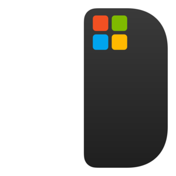

# RectangleWin



A **Windows port** of [Rectangle](https://github.com/rxhanson/Rectangle) — the keyboard-driven window tiling manager for macOS.

Full credit goes to **Ryan Hanson** and the original Rectangle app. I loved using it on macOS so much that I wanted the same experience on Windows. I had used FancyZones (PowerToys) before, but Rectangle’s keyboard shortcuts are much more convenient: halves, quarters, thirds, maximize, center, restore, and move between displays, all from the keyboard without touching the mouse. This project aims to replicate that workflow on Windows.

RectangleWin is a minimal tray app: global hotkeys (Win+Alt by default), optional launch at startup, and configurable gaps. Edit `config.json` to change shortcuts.

---

## Requirements

- Windows 10/11
- .NET 8 (or use the self-contained installer)

## Build & run

```bash
dotnet build src\TrayApp\TrayApp.csproj -c Release
# Run: src\TrayApp\bin\Release\net8.0-windows10.0.19041.0\x64\RectangleWin.exe
# Or publish for a single folder:
dotnet publish src\TrayApp\TrayApp.csproj -c Release -r win-x64 --self-contained true
```

## Installer

See [installer/README.md](installer/README.md). Build the app, then compile the Inno Setup script to get `RectangleWin-Setup-0.1.exe` with an optional “Launch at startup” checkbox.

## Config

Config path: `%LocalAppData%\RectangleWin\config.json`. You can change hotkeys (default: Win+Alt + key), gap size, and launch-at-startup. Restart the app after editing.

## Original project

- **Rectangle (macOS):** [github.com/rxhanson/Rectangle](https://github.com/rxhanson/Rectangle) — window management app based on Spectacle, by Ryan Hanson.

## License

MIT. See [LICENSE](LICENSE). This project is a Windows port inspired by Rectangle; Rectangle is Copyright (c) 2019–2025 Ryan Hanson (based on Spectacle, Copyright (c) 2017 Eric Czarny).
